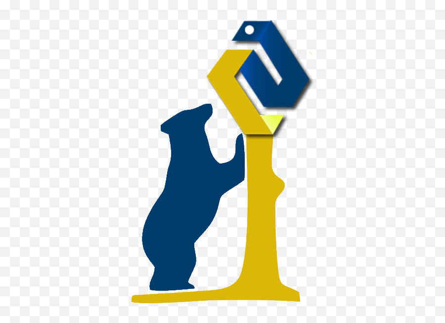

<h1 align='center'>Hi , I'm Emanuele  </h1>

I’m here to share my learning journey!  
I have a master’s degree in Molecular Biology🧬, but now I’m an aspiring <b>Data Scientist</b>.  
Here you can find all my personal projects and those that I realized for <b>Python and Data Science</b> courses I studied. 

My aim is to <i>spread my knowledge</i> and edit all my resources in a well documented and explanatory way, with the hope that anyone can consult my repositories and find something useful!  

 

## About me:

- 📒 I'm currently studying Machine Learning
- 💡 I want to improve note-taking/knowledge management with [Obsidian](https://obsidian.md) and learning techniques for my personal growth
- 🤝🏻 I'd like to realize collaborations for Data Science and Python scripting projects 
- 🥅 2022 Goals: 
  - Complete Data Science course on [start2impact](https://www.start2impact.it/?utm_source=google&utm_medium=cpc&utm_campaign=Search_Brand&gclid=Cj0KCQjw2MWVBhCQARIsAIjbwoNBIfEvWZX83gC74NsYdE7ybID-KGgD8VOZ259wvJ6aeuB_Qh2458waAryxEALw_wcB); 
  - Get hired for an amazing job
- 🌍 Overall Goals:
  - Merge AI and ML technologies with Biological/Medical sciences;
  - Help build a better future for the world;
  - Die in peace (possibly elder)
- 👻 Fun fact: I keep falling in 'rabbit holes' because I'm obsessed with knowledge 🤷🏻

---
## Languages and Tools I currently use:
[][python]
[][jupyter]
[][numpy]
[][pandas]
[][matplotlib]
[][seaborn]
[][plotly]
[][anaconda]
[][vscode]
[][git]
[][github]  

---
## Find me:

[][twitter]
[][linkedin]
[][kaggle]  

---
## :zap: Recent GitHub Activity

  
<!--START_SECTION:activity-->
1. 🗣 Commented on [#156](https://github.com/codeSTACKr/create-10k-nft-collection/issues/156) in [codeSTACKr/create-10k-nft-collection](https://github.com/codeSTACKr/create-10k-nft-collection)
2. 🎉 Merged PR [#156](https://github.com/codeSTACKr/create-10k-nft-collection/pull/156) in [codeSTACKr/create-10k-nft-collection](https://github.com/codeSTACKr/create-10k-nft-collection)
3. ❌ Closed PR [#44](https://github.com/codeSTACKr/minter-dapp/pull/44) in [codeSTACKr/minter-dapp](https://github.com/codeSTACKr/minter-dapp)
4. 🗣 Commented on [#44](https://github.com/codeSTACKr/minter-dapp/issues/44) in [codeSTACKr/minter-dapp](https://github.com/codeSTACKr/minter-dapp)
5. ❌ Closed PR [#45](https://github.com/codeSTACKr/minter-dapp/pull/45) in [codeSTACKr/minter-dapp](https://github.com/codeSTACKr/minter-dapp)
<!--END_SECTION:activity-->

## :zap: GitHub Stats

 

[twitter]: https://twitter.com/EmanueleImmesi
[linkedin]: https://www.linkedin.com/in/emanuele-immesi-5004141b9/
[kaggle]: https://www.kaggle.com/emanueleimmesi
[python]: https://www.python.org
[jupyter]: https://jupyter.org
[numpy]: https://numpy.org
[pandas]: https://pandas.pydata.org
[matplotlib]: https://matplotlib.org
[seaborn]: https://seaborn.pydata.org
[plotly]: https://plotly.com/python/
[anaconda]: https://www.anaconda.com/products/distribution
[vscode]: https://code.visualstudio.com
[git]: https://git-scm.com
[github]: https://github.com